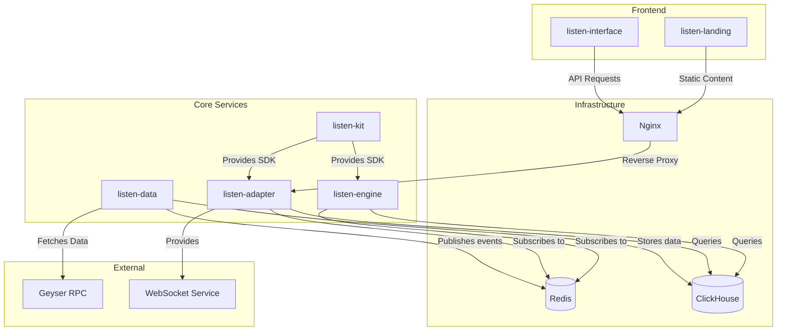

# Service Dependencies

## Service Descriptions

### Core Services
- **listen-data**: Main data indexer and processor
  - Connects to Geyser RPC for blockchain data
  - Stores processed data in ClickHouse
  - Publishes events to Redis

- **listen-adapter**: API and WebSocket service
  - Subscribes to Redis for real-time updates
  - Queries ClickHouse for historical data
  - Provides WebSocket interface for clients

- **listen-engine**: Processing engine
  - Subscribes to Redis for events
  - Processes complex data operations
  - Uses ClickHouse for data storage

- **listen-kit**: SDK and utilities
  - Provides common functionality
  - Used by adapter and engine

### Infrastructure
- **Redis**: Message broker and cache
  - Handles real-time event distribution
  - Enables service communication

- **ClickHouse**: Analytics database
  - Stores processed blockchain data
  - Enables fast analytical queries

- **Nginx**: Web server and reverse proxy
  - Routes API requests
  - Serves static content

### Frontend
- **listen-interface**: Main web interface
  - Connects to adapter through Nginx
  - Provides user interface

- **listen-landing**: Landing page
  - Static content
  - Served through Nginx

### External Services
- **Geyser RPC**: Blockchain data source
- **WebSocket Service**: Real-time data updates